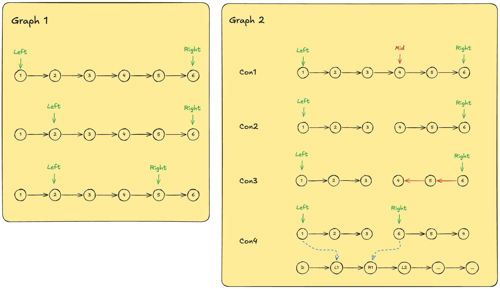
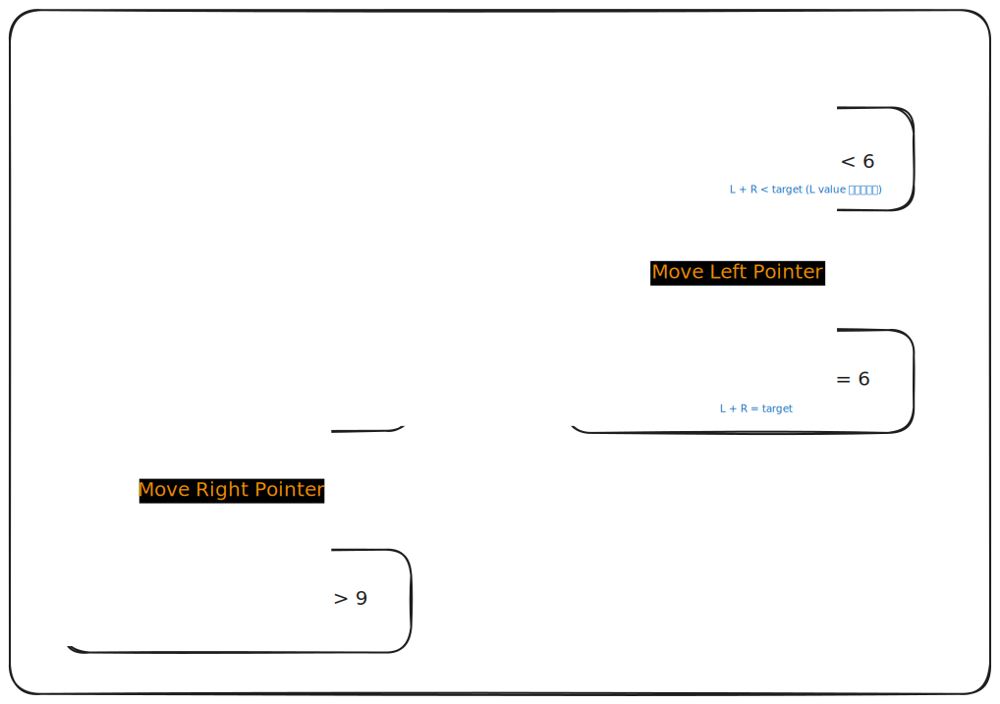
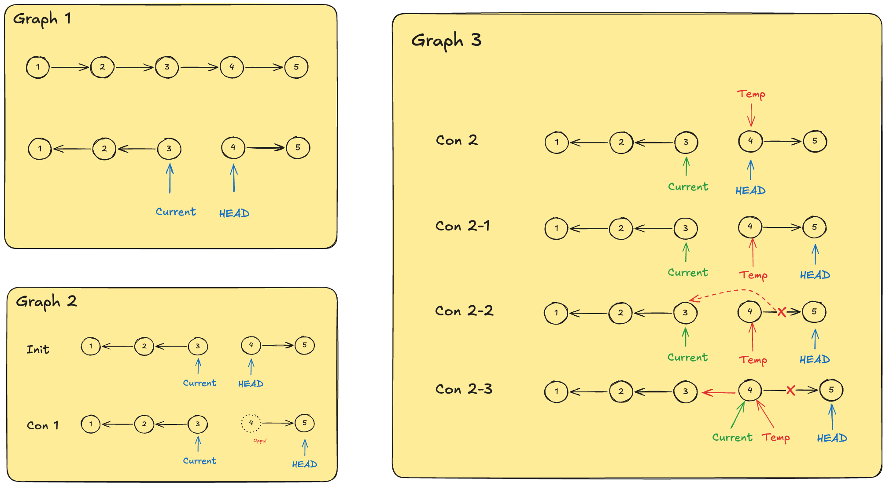
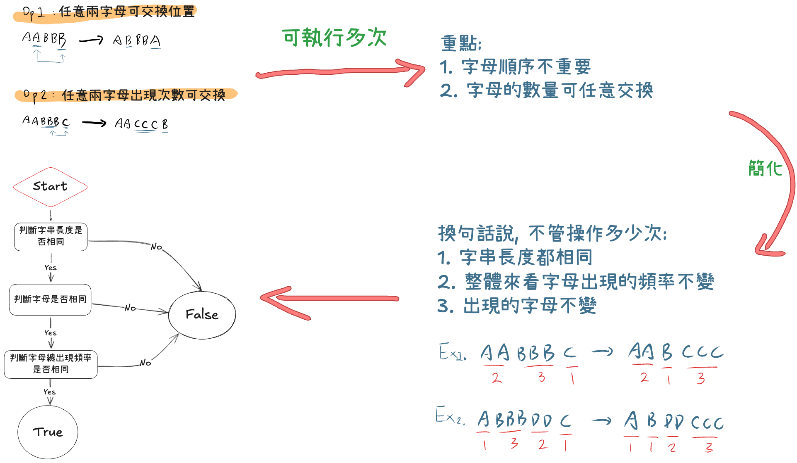

# Notes

## 題目說明

### 1. Two Sum
- 說明: 
  - 尋找陣列中兩數之和等於 target 並返回兩元素的位置陣列, 保證陣列中各數字只會使用一次且每題僅有唯一解
- 解題方法：
  1. [BF 解 O(n^2)](./1.two-sum/1.two-sum.js)
  2. [Map 解 O(n)](./1.two-sum/1.two-sum-improve.js)
  3. [Map 解優化 (One pass)](./1.two-sum/1.two-sum-improve-one-pass.js): 邊檢查邊建立 hash map, 不用先掃一遍 array
- 小記 & 心得：
  - 上次寫這題是很久之前了,對 map 的使用不熟, 所以一直抓不到為何能夠 O(n) 解
  - 記住一個重點就行, map 查找複雜度為平均為 O(1), 最差為 O(n)
- Tags: *array, hash-table*
- 難度: Easy
- [X] post

### 3. Longest Substring Without Repeating Characters
- 說明:
  - 給一個字串, 求最長不重複字元的子字串
- 解題方法:
  - [sliding window](./3.longest-substring-without-repeating-characters.js): 遍歷 array 並持續更新 maxLength 值, 關鍵是利用 map or set 來快速確認新的字元是否已經存在
- 小記 & 心得
  - 比較 trick 的部分是如何移動 left pointer, 讓每一次的區間 （連續substring）皆為不重複字元
  - 
- Tags: *Hash Table, Sliding Window*
- 難度: Medium
- [X] post

### 11. Container With Most Water
- 說明：
  - 給一個一維 array 表示柱子的柱高, 求任意兩柱子可圍成的最大含水量
- 解題方法：
  - [two pointer O(n)](./11.container-with-most-water.js): 兩個 pointer 一前一後選擇往中心選擇可能圍成更大容積的柱子前進, 持續將 max area of water 紀錄 & 更新, 直到兩柱子相會 
- 小記 & 心得：
  - 經典 two pointer 題目, 還記得大學跟其他人一起解的時候卡很久
  - 重點在於找出如何移動 two pointer 的方法
- Tags: *two-ponter*
- 難度: Medium
- [X] post

### 15. 3 Sum
- 說明：
  - 給一個一維數字陣列, 找出所有 ３ 個相加為 0 的組合並放在 array 中返回, 順序沒限制,但組合不能重複
- 解題方法：
  - [將其拆成數個 2 sum 問題](./15.3-sum/15.3-sum.js): 將陣列 sort 後就變成數個 2 sum sorted array （題目：167.two-sum-ii-input-array-is-sorted）加上一點 edge case 處理
- 小記 & 心得：
  - two sum 有想到, 但是處理 duplicate 的方式卡了很久
- Tags: *array, two-pointer, sorting*
- 難度: Medium
- [X] post

### 19. Remove nth Node From End of List
- 說明：
  - 給一個 linked list head 與 數字 n, 返回移除倒數第 n 個 node 之後的新 linked list
- 解題方法：
  - [two pass](./19.remove-nth-node-from-end-of-list/19.remove-nth-node-from-end-of-list.js): 先遍歷一遍計算 list 長度, 在遍歷一次移除要移除的 node
  - [one pass](./19.remove-nth-node-from-end-of-list/19.remove-nth-node-from-end-of-list-one-pass.js): 用兩個指標, 先讓其中一個指標走 n 步, 之後再同時移動兩個指標, 直到其一碰到底, 另一個指標的下一個 node 即為要移除之 node。
- 小記 & 心得：
  - 也是一個有意思的題目, 感覺 linked list 題目有不少 two pointer 題啊
- Tags:
  - *Linked List*
- 難度: Medium
- [X] post

### 20. Valid Parentheses
- 說明：
  - 給一個只包含 {,[,(,),],}  六個字元的字串, 求這個字串的括號組合是否合理
- 解題方法：
  - [stack 解法](./20.valid-parentheses/20.valid-parentheses.js)
  - [stack 解法優化](./20.valid-parentheses/20.valid-parentheses-improve.js)
- 小記 & 心得：
  - 這題就是用 stack 解, 了解為何要使用 stack 資料結構後就通了, 不難的題目。
  - 優化解法可以看一下, 整理一下 if-else 結構當(只需要新增在 object 中)
- Tags:
  - *String, Stack*
- 難度: Easy
- [X] post

### 21 Merge Tow Sorted List
- 說明：
  - 給兩個 Linked List 的 head (node), 其中這兩個 Linked List 中 node 的 value 是由小到大排序, 返回兩個 list 合併之後的結果 (須維持由小到大的排序限制)
- 解題方法：
  - [兩兩比較, 類似 two pointer](./21.merge-two-sorted-lists/21.merge-two-sorted-lists.js)
  - [Space 優化, O(1)](./21.merge-two-sorted-lists/21.merge-two-sorted-lists-space-improve.js)
- 小記 & 心得：
  - 基礎題目, 可當作複習 Linked List 的基本操作
- Tags:
  - *Linked-List*
- 難度: Easy
- [X] post

### 23. Merge K Sorted List
- 說明：
  - 給一個 array lists 其中為數個 sorted linked list 的 head （linked list 中的 node 值由小到大排序）, 將所有 linked list 合併成一個新的 sorted linked list 後返回
- 解題方法：
  - [sort 解](./23.merge-k-sorted-list/23.merge-k-sorted-lists.js): 先記錄下所有的 node valud, 將其排序後再建立一個全新的 sorted linked list
  - [multiple merge two sorted list](./23.merge-k-sorted-list/23.merge-k-sorted-lists-improve.js): 執行數次 merge two sorted list 的操作直到 array 中所有的 linked list 都合併完成
- 小記 & 心得：
  - 應該是寫過最簡單的 HARD 題目了, 暴力解的部分
  - multiple 解法簡單易懂, 但是實作的時候搞了滿久, 最後在紙上把示意圖畫出來後才順利完成, 太多指標真的容易頭昏。
- Tags:
  - *Linked List*
- 難度: Hard
- [X] post

### 36. Valid Sudoku
- 說明：
  - 給一個二維陣列表示數獨的樣貌, 求該數獨是否合法
- 解題方法：
  - [迴圈遍歷三次](./36.valid-sudoku/36.valid-sudoku.js)
  - one pass 解
- 小記 & 心得：
  - 看了網路上的 one pass 解, 不是很懂要如何使用 JS 重現
- Tags: *array, hash-table*
- 難度: Medium

### 42. Trapping Rain Water
- 說明：
  - 給一個一維數字陣列表示像素高, 求像素圖所能裝買的的最大水量
- 解題方法：
  - [Two Array (maxLeft & maxRight)](./42.trapping-rain-water/42.trapping-rain-water.js): 單位格子水能困住的水量為: min(左側最高點, 右側最高點) - 當前柱高, 用兩陣列分別計算出每一格的 maxLeft & maxRight 後, 再依序計算將加總即為解答。 Space: O(n)
  - two pointer 解： Space O(1)
- 小記 & 心得：
  - 第一個 Hard 題目, 被 two pointer 誤導, 沒想到用兩個陣列就能解
  - two pointer 題目找時間再寫, 滿 tricky 的
- Tags: *two-pointer*
- 難度: Hard

### 49 Group Anagram
- 說明：
  - anagram (相同字母異序詞), 給定一個 input 字串陣列, 找出互為 anagram 的字串並將其放在同一個陣列中返回, order 不限, 字串可為空 ("")
```
Input: strs = ["act","pots","tops","cat","stop","hat"]
Output: [["hat"],["act", "cat"],["stop", "pots", "tops"]]
```
- 解題方法：
  1.  [sort 字串後找出 anagram 在陣列中的位置](./49.group-anagram/49.group-anagrams.js): Time: O(m * nlogn)
  2.  [Bucket 解](./49.group-anagram/49.group-anagrams-bucket.js): 用 count 找出 anagram , Time: O(m * n)
- 小記 & 心得：
  - 242-valid-anagram 的進階, 多了個尋找字串在陣列中的位置
  - 使用 JS object 替代 map 來寫需要注意, 因 JS object 非 iterable, 所以 keys & Values 要透過 JS 提供的 method 來取得
  - 也許有更好的解法, 暫時未知
- Tags: *array, hash table, string, sorting*
- 難度: Medium
- [X] post

### 102 Binary Tree Level Order Traversal
- 說明:
  - input 一個 binary tree 的 head node, 將 tree 的 node value 以 level order 的方式返回 (nested list, 相同 level 在同一 list 中)
- 解題方法:
  - [BFS](./102.binary-tree-level-order-traversal/102.binary-tree-level-order-traversal-bfs.js)
  - [DFS](./102.binary-tree-level-order-traversal/102.binary-tree-level-order-traversal-dfs.js)
- 小記 & 心得:
  - BFS 熟悉之後反而比較簡單
  - DFS 解法是參考 [104 題](#104-maximum-depth-of-binary-tree) 算 depth 的方法想到的, 有點 tricky, 但還算好理解
- Tags: *Binary Tree*
- 難度: Medium
- [X] post

### 104 Maximum Depth of Binary Tree
- 說明:
  - input 一個 binary tree 的 head node, 定義 tree 的 depth, 其中 head node 為 1, head 的 left & right 為 2, 依此推類 ,求這個 binary tree 的 maximum depth
- 解題方法:
  - [Top Down (BFS)](./104.maximum-depth-of-binary-tree/104.maximum-depth-of-binary-tree-bfs.js)
  - [Bottom Up](./104.maximum-depth-of-binary-tree/104.maximum-depth-of-binary-tree-dfs.js)
- 小記 & 心得:
  - 以前有學過這題, 所以 Bottom Up Approach 很容易就寫出來
  - BFS 熟悉實作後也不難
- Tags: *Binary Tree*
- 難度: Easy
- [X] post

### 121 Best Time to Buy and sell stock
- 說明：
  - 給一個一維數字陣列表示隨時間的股票金額, 求這段時間內的最大獲利 (賣 - 買)
- 解題方法：
  - [two pointer 變形](./121.best-time-to-buy-and-sell-stock.js)： 遍歷 array 找出最低點 ＆ 持續更新 maxProfix 就行
- 小記 & 心得：
  - 對這題有印象, 懂了之後就非常簡單明瞭且不會忘了解答
- Tags:
  - Array
- 難度: Easy
- [X] post


### 125 Valid Palindrome
- 說明：
  - 給一個 string, 若該 string 的所有字母 & 數字字元從頭與尾一一比對相同的話, 此 string 為 palindrome 返回 true, 反之則回 false
- 解題方法：
  - [回圈解 O(n)](./125.valid-palindrome.js)
- 小記 & 心得：
  - 這題滿單純的, 就是要知道怎麼轉換大寫字母為小寫, 並過濾掉所有非數字 ＆ 英文字母的字元 (ASCII), 每個語言提供的轉換函式不同, 用到在查, 不用死記硬背
- Tags:
- 難度: Easy

### 141 Linked List Cycle
- 說明：
  - 給一個  Linked List head, 判斷該 linked list 的尾端, 是否又指向之前的 node, 此時整個 linked list 形成一個 cycle, 有 cycle 回傳 true, 反之則回 false
- 解題方法：
  - Contain Duplicate 解：類似 contain duplicate 題目判斷 node 是否重複
  - [fast && slow pointer](./141.linked-list-cycle.js): 快慢指標, 快指標一次走兩步, 慢指標一次一步, 當快指標走到底前追上慢指標即表示有 cycle, 反之則無
- 小記 & 心得：
  - 簡單易懂又有趣的題目, 寫過一次就不會忘
- Tags: *Linked List*
- 難度: Easy
- [X] post

### 143 Reorder List
- 說明：
  - 給一個 linked list 的 head, 根據題目規則重新排序整個 Linked List, 題目限制不能更改 node 本身的值, 只能更改 node 本身。其中的規則為, 原先的 list L0 → L1 → … → Ln - 1 → Ln, 會重新排序為 L0 → Ln → L1 → Ln - 1 → L2 → Ln - 2 → … 
- 解題方法：
  - [Space O(n)](./143.reorder-list/143.reorder-list.js)
  - [Space O(1)](./143.reorder-list/143.reorder-list-improve.js)
- 小記 & 心得：
  - 滿 tricky 的,又是一個自己想不到, 但是看 Hint 就恍然大悟的題目。
  - 很好的融合 [206 - Reverse Linked List](#206-reverse-linked-list), [21 - Merge Two Sorted List](./21.merge-two-sorted-lists/), [876 - Middle Of The Linked List](./876.middle-of-the-linked-list.js) 這三個 Easy 題的進階題, 值得多寫幾次 XD
  - 
- Tags: *Linked-List*
- 難度: Medium
- [X] post

### 155 min-stack
- 說明：
  - 給一個 min-stack 的定義, 根據限制條件實作所有的 method 。
- 解題方法：
  - [多一個 stack 解](./155.min-stack.js)：多一個 stack 資料結構來記錄隨著值加入而改變的 minValue 值,此 min-stack 會跟著原本的 stack 結構 push & pop, 所以所有 method 操作都可以在 O(1) 哪做完
- 小記 & 心得：
  - 有趣的一個小題目, 想通了之後簡直豁然開朗, 而且非常有意思的是, 題目名稱本身就是一個最大的提示 (min-stack) XD
- Tags: *Stack*
- 難度: Medium
- [X] post

### 167 Two Sum II - Input Array is Sorted
- 說明：
  - 給一個已經 sort 過的 (asc) 的 一維數字陣列, 求和為 target 的位置
- 解題方法：
  - [two pointer O(n)](./167.two-sum-ii-input-array-is-sorted.js): 跟 11 題 container-with-most-water 類似, 都是用 two pointer 一前一後向中間移動解
  - 
- 小記 & 心得：
  - 重點是如何選擇要移動 two pointer 中的哪一個 pointer
- Tags: *two-pointer*
- 難度: Medium
- [X] post

### 190 Reverse Bits
TODO

### 191 Number of 1 bits
- 說明：
  - 給一個正整數 n, 求其轉換成二進制後, bit 為 1 的數量加總。
- 解題方法：
  - [用短除法的過程來計算 total](./191.number-of-1-bits.js)
- 小記 & 心得：
  - 就是一個數學題目, 了解 10 進位轉 2 進位的原理與方法後就可以寫出來
- Tags:
  - *Divide and Conquer, Bit Manipulation*
- 難度: Easy
- [X] blog post

### 206 Reverse Linked List
- 說明：
  - 給一個 Linked List 的 head, 將此 linked list 反轉後並 return head
- 解題方法：
  - [額外空間](./206.reverse-linked-list/206.reverse-linked-list-additional.js): 先遍歷一遍 array 並將 value 存在 array 中, 最後在建一個新的反轉 LinkedList, 會使用到額外空間 O(n+n)=O(n)
  - [iterative](./206.reverse-linked-list/206.reverse-linked-list-iteratively.js): 遍歷 LinkedList, 一邊 run 一邊反轉整個 LinkedList
  - [recurrsive](./206.reverse-linked-list/206.reverse-linked-list-recursive.js): 遞歸解法, 將問題轉換成更小的子問題(在這題中為下一個 node 形成的 reverse list), 處理好 edge case 即可
- 小記 & 心得:
  - iterative 以前就學過, 所以還算容易
  - recurrsive 得解法好像是第一次看到, 一開始比較抽象一點, 但將圖畫出來後有比較好理解了
  - 
- Tags: *Linked-List*
- 難度: Easy
- [X] post

### 217 Contain Duplicate
- 說明：
  - input 一個數字陣列, 若陣列中有重複的數字則 return true, 反之則 false
- 解題方法：
  1. BF 解： O(n^2) 遍歷 array 來檢查是否重複
  2. Sort 解：先 sort 陣列後再遍歷 sorted array, 相同數字會相鄰, 逐個兩兩比較即可。Time: O(nlogn)
  3. [Map 解一](./217.contains-duplicate/217.contains-duplicate.js)：遍歷一遍 array 並建立 map 紀錄 (key: nums[i], value: i), 最後再遍歷 array 檢查 map 中是否已經存在相同 key 但是 value 不同值
  4. [Map 解二](./217.contains-duplicate/217.contains-duplicate-improve.js): 跟 anagram 題類似, map 中儲存不同數字出現的次數, Time: O(n)
  5. Set 解: set 是一個不會包含重複資料的資料結構,遍歷 array 並建立 set, 最後再比較兩者的大小是否不同即可
- 小記 ＆ 心得：
  - 這題就一樣是在練習 map 結構的使用, 不過實作是用 JS object 來替代 map 
- Tags: array, hash table, sorting
- 難度: Easy
- [X] post

### 226 Invert Binary Tree
- 說明:
  - input 一個 binary tree 的 head node, 將整個 binary tree 做 invert (head node 之下所有 left node & right node 互相交換)並返回
- 解題方法:
  - [BFS](./226.invert-binary-tree/226.invert-binary-tree-bfs.js)
  - [DFS iterative](./226.invert-binary-tree/226.invert-binary-tree-dfs-iterative.js)
  - [DFS recursive](./226.invert-binary-tree/226.invert-binary-tree-dfs-recursive.js)
  - [Top Down recursive](./226.invert-binary-tree/226.invert-binary-tree-top-down.js)
  - [Bottom Up recursive](./226.invert-binary-tree/226.invert-binary-tree-bottom-up.js)
- 小記 & 心得:
  - 複習了 dfs & bfs, 還順便回想了以前講過的 Top Down & Bottom Up
- Tags:
  - *Binary Tree*
- 難度: Easy
- [X] post

### 238 Product Of Array Expect Self
- 說明：
  - 給定一個數字陣列, 返回除了該位置外所有數字相乘的結果的陣列
  - leetcode 要求: 在不使用除法的狀況下, 寫出時間複雜度 O(n) 的解
```
Example 1:

Input: nums = [1,2,3,4]
Output: [24,12,8,6]

Example 2:

Input: nums = [-1,1,0,-3,3]
Output: [0,0,9,0,0]
```
- 解題方法：
  1. [BF 解 O(n^2)](./238.product-of-array-expect-self/238.product-of-array-except-self_bruteForce.js): leetcode time limt exceed, 這解法可忽略ｓ
  2. [除法 解 O(n)](./238.product-of-array-expect-self/238.product-of-array-except-self_division.js): 不符合 leetcode 要求, 但可當作參考
  3. [使用 prefix && suffix 解](./238.product-of-array-expect-self/238.product-of-array-except-self_prefix_suffix.js): Time: O(n), Space: O(n)
  4. [優化 prefix && suffix 解](./238.product-of-array-expect-self/238.product-of-array-except-self_prefix_suffix_improve.js): TimeL O(n), Space: O(1)
- 小記 & 心得：
  - 就算是**除法解**也不能無腦先相乘所有數字, 因為可能包含 0, 需要特別處理
  - prefix && suffix 解肯定是沒辦法靠自己想出來的特殊解法....
- Tags: array
- - 難度: Medium

### 242 Valid Anagram
- 說明：
  - input 兩個字串 a,b 判斷這兩個字串是不是 anagram （相同字母異序詞）
- 解題方法：
  1. [sort 解](./242-valid-anagram/242.valid-anagram.js): 講兩個字串先 sort 後再比對是否相同, Time: O(nlogn)
  2. [Map 解](./242-valid-anagram/242.valid-anagram-improve.js): 將字串中的字母存到 map 中統計, 這樣就不用先排序, Time Complexity: O(n)
  3. [Map 解 2](./242-valid-anagram/242.valid-anagram-improve2.js): 同上, 但是在簡潔一點, 且是使用真正的 Map, 而不是 Object
- 小記：
  - sort 方法有借助 JS 的幾個 method, split(), sort(), join() 來處理字串排序
- Tags: hash table, sorting
- 難度: Easy
- [X] post

### 268 Missing Number
- 說明：
  - input 會給一個大小為 n 的數字 array nums, 其中 array 內的數字範圍為 [0,n] , 例如: n 為 2 時, [0,2] 為 0,1,2 。求 nums 中缺失的那個整數數字。
- 解題方法：
  - Sort 法一：直接 sort input 後在遍歷回圈找出答案
  - [Sort 法二](./268.missing-number/268.missing-number.js)：使用 bucket 存數字, 在找出缺的那一個
  - [Math 解法](./268.missing-number/268.missing-number-improve_math.js): 完美陣列 - input = missing number
  - [Bitwise XOR 解](./268.missing-number/268.missing-number-improve_xor.js): 利用 XOR 的數學邏輯求出 missing number
- 小記 & 心得：
  - 沒想到最一開始的解法居然多此一舉, 我居然沒想到 sum 解如此單純的優化, 寫 sort 問題寫多了 XD
  - XOR 解：這又是哪一位天才想到的解法, 凡人基本上不可能自己想出來的。
- Tags: *Array, Hash Table, Math, Binary Search, Bit Manipulation, Sorting*
- 難度: Easy
- [X] post

### 271 Encoded And Decode Strings
- 說明：
  - 寫一個 encode 的 function 讓包含任意 UTF-8 字元的 string array 可以被轉換成純字串, decoded function 將字串轉回 string array
- 解題方法：
  - [紀錄長度](./271.encode-and-decode-strings.js)：因為可以包含任意 UTF-8 字元, 所以只用 #, % 等當作分隔符號在 decode 的時候會拆錯字, 可以將各個字串的長度作為資訊放到 encode string 中, 這樣在 decode 時就不會拆錯
- 小記 & 心得：
  - 還以為是要用比較複雜的 separater 去解, 沒想到有這種方法
- Tags: *string*
- 難度: Medium

### 338 Counting Bits
- 說明：
  - 給一個整數 n , 返回一個大小為 n+1 的數字陣列, 其中的每項元素 i (0 <= i <= n) 為 i 轉換成二進制後 bit 1 的數量。
- 解題方法：
  - [Brute Force](./338.counting-bits/338.counting-bits.js): 跑 n 遍 Number-of-1-bits 建立起 array result, Time: O(nlogn)
  - [DP 解](./338.counting-bits/338.counting-bits-improve.js): 找出規律並 bottom up 建立起規則
  - 
- 小記 & 心得：
  - 這題如果是用 Brute Force 的話的確是 easy 題, 因為就是執行數個 number-of-1-bits 的運算 (短除法), 但要在 O(n) 解的話就必須使用 DP 了, 難度肯定有到 medium
- Tags:*Dynamic Programming, Bit Manipulation*
- 難度: Easy
- [X] post

### 347 Top K Frequent Element
- 說明：
  - 給兩個 input： num array & k, 求 array 中的數量前 k 筆的數字並返回陣列, 題目保證輸入只有唯一解
```
Input: nums = [1,2,2,3,3,3], k = 2
Output: [2,3]
```  
- 解題方法：
  1. [Map 解](./347.top-k-frequent-element/347.top-k-frequent-elements.js)：遍歷 array 並建立數字統計的 map，最後再找出統計前 k 筆並返回陣列結果
  2. Heap 解： 使用 heap 來找出前 k 筆, Time: O(nlogk)
  3. [類似 heap 的 bucket 解](./347.top-k-frequent-element/347.top-k-frequent-elements_bucket.js)： Time: O(n)
- 小記 & 心得：
  - 在 Map 中找出前 K 筆最大的方式也許有更好的做法? 抑或是 map 的 key:value 儲存內容需要調整
- Tags: array, hash table, heap 
- 難度: Medium

### 424 Longest Repeating Character Replacement
- 說明：給一個  input 字串 s, 與一個整數 k , 其中 k 表示可以用任意字元替換 s 中單一字元的次數, 求 s 經過最多 K 次操作後, 所能包含的最大 “相同字元子字串”。例：S = AAAABA, k=2, 此時  result 為 6 (B 可替換成 Ａ)
- 解題方法：
  - [Sliding Window 解](./424.longest-repeating-character-replacement/)
- 小記 & 心得：
  - 好難...就算是暴力解也需要思考一下, 在沒有提示的情況下, 跟 Hard 差不多 XD
  - 這題的思考過程中分享在 [blog post - leetcode w5](https://victorchao996.github.io/blog/Post/leetcode_weekly_practice/leetcode_w5.html#leetcode-practice-w5) 中
- Tags: *Hash Table, String, Sliding Window*
- 難度: Medium
- [X] post

### 876 Middle of the Linked List
- 說明：
  - 給一個 Linked List 的 head, 返回此 linked list 的中間 node, 若 node 總數為偶數, 則返回中間兩
 node 的後者。
- 解題方法：
  - [快慢指標](./876.middle-of-the-linked-list.js)
- 小記 & 心得：
  - 又是一個想通之後就不會忘記的簡單題目
- Tags: *Linked-List*
- 難度: Easy
- [X] post


### 1657 Determine If Two Strings Are Close
- 說明：
  - 給兩個 input string, 若其中一個字串經過任意次數的兩種 operation 後與另一字串相等, 則稱兩個字串為 "Close"。其中運算一為, 字串中的兩字元位置可以任意交換, 運算二為不同的字串出現的頻率可以互相交換。
- 解題方法：
  - 找出關鍵, 能經過上述兩個運算表示字元順序不重要且字串中各個字元出現的總頻率是固定的, 依據以上思路去解答即可
  - [參考解](./1657.determine-if-two-strings-are-close.js)
- 小記 & 心得：
  - 雖然有看了 Hint, 但是沒有想到解這題的時候有這麼順利, 不到十分鐘就寫出來了, 這給我滿大的成就感的 XD, 寫 Easy 題都不見得可以這麼快了, 更別說 Medium。
  - 用 excalidraw 畫了思考圖：
- Tags: *Hash Table, String, Sorting, Counting*
- 難度: Medium
- [ ] post

### Template
- 說明:
- 解題方法:
- 小記 & 心得:
- Tags:
- 難度:
- [ ] post


