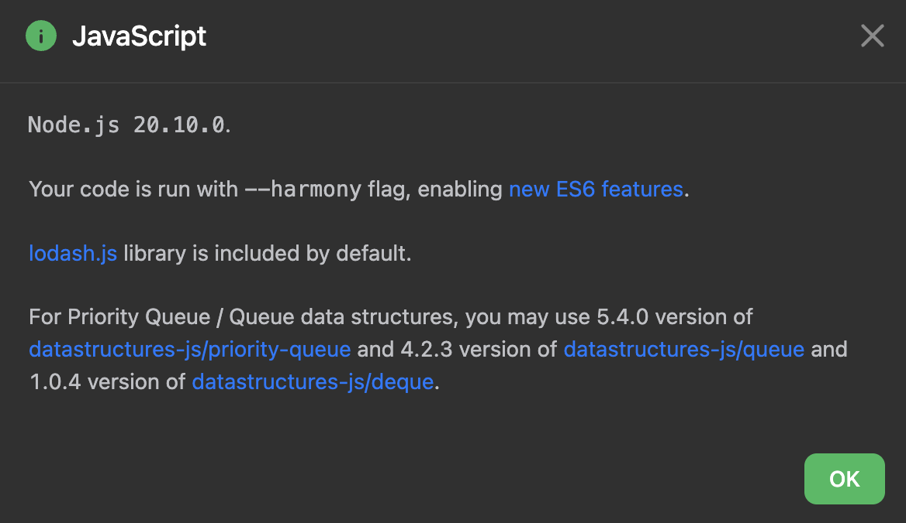

# leetcode 練習
## 源起
該刷的題目還是要刷, 一直以來都覺得寫至些題目很沒有意義, 也不是自己擅長的部分, 但現在換個角度想, 這種有考古題可以準備的環節都表現得不好得話, 我想好的職缺機會想都不用想,更別想談好 offer 了。 

所以想趁目前職涯相對比較穩定的這個空擋,把之前的罩門變成自己得優勢, 是時候來認真刷個 leetcode。

## 目標
1. 6 個月**至少**寫過一遍 Blind 75 (deadline: 2025/4/10)
2. 1 年內**至少**寫過一遍 Neetcode 150 (deadline: 2025/10/10)
3. 參加 leetcode 周賽 **至少** 十次

## 檔案說明
- file/folder 命名方式：
  - 使用 vscode leetcode 插件產生的檔案 (題目號 + 題目名)
  - 不同解法則會加上不同後綴名 （如： contains-dupliate-improve）
- Notes.md: 
  - 題目心得 & 小記

## Notes
- javascript 沒有內建 queue 相關資料結構, leetcode 使用第三方 library 來支援 queue/priority-queue 
  - 
  - [Github: datastructures-js/queue](https://github.com/datastructures-js/queue/tree/v4.2.3)
    - `import { Queue } from "@datastructures-js/queue";`

## Reference
- [neetcode （leetcode 練習網站）](https://neetcode.io/)
- [YT 刷題經驗分享](https://www.youtube.com/watch?v=dJc-h7ui8wc)
- [B站算法題動畫解說](https://www.bilibili.com/video/BV1pz421h7ZX/?spm_id_from=333.337.search-card.all.click&vd_source=1140b1e79766052dfe86144117362782)

## Tracking
- 題目完成統計:
	- Easy: 16 題
	- Medium: 16 題
	- Hard: 3 題
- 總完成題數: 35/36 題
- 階段性目標："完成 Leetcode/Neetcode 75 題", 共 75 題
- 文章發布進度: 27 篇
	- 階段目標達成度: 27/75 = 36.00%

